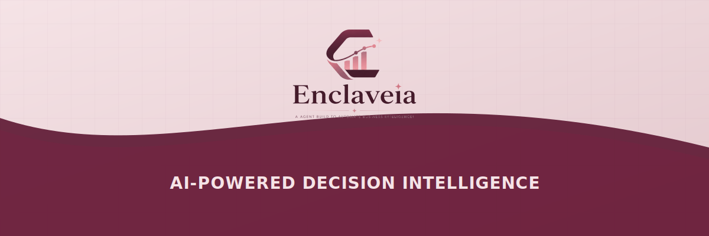

<div align="center">

  

  <br/>
  <br/>

  <a href="https://ollama.ai/"></a>
  <a href="https://nextjs.org/"></a>
  <a href="https://fastapi.tiangolo.com/"></a>
  <a href="LICENSE"></a>
  <a href="#"></a>

  <br/>
  <br/>

  <p><strong>100% Local &nbsp;·&nbsp; Zero Data Leakage &nbsp;·&nbsp; AI-Powered Decision Intelligence</strong></p>
  <p><em>Transform raw datasets into executive dashboards and AI insights — entirely on your machine.</em></p>

  <br/>

  [The Problem](#-the-problem) &nbsp;·&nbsp;
  [The Solution](#-the-solution) &nbsp;·&nbsp;
  [Architecture](#️-architecture) &nbsp;·&nbsp;
  [Tech Stack](#-tech-stack) &nbsp;·&nbsp;
  [Features](#-feature-highlights) &nbsp;·&nbsp;
  [Setup](#-local-setup) &nbsp;·&nbsp;
  [Roadmap](#-whats-next-for-enclaveia)

</div>

---

## 🔒 The Problem

Businesses and teams today hesitate to upload sensitive financial, healthcare, or proprietary datasets to cloud-based AI tools. The reasons are clear:

| Pain Point | Reality |
|---|---|
| 🌐 **Data Privacy Risks** | Your data hits external servers — you lose control |
| 🧱 **Compliance Walls** | HIPAA, GDPR, and internal policies block cloud AI use |
| 💸 **Unpredictable API Costs** | Token-based pricing scales badly with large datasets |
| 🏚️ **Inequality** | Rural clinics, NGOs, and small teams are left behind |

While large corporations spend millions building private AI infrastructure, the rest of the world is completely shut out of the AI revolution.

---

## ✅ The Solution

**Enclaveia** is a fully local, on-premise AI decision intelligence dashboard.

By running Google's highly efficient **Gemma 2 (2B)** model entirely on your machine via **Ollama**, Enclaveia guarantees **zero data leakage** — your data never leaves your laptop.

> Upload a CSV or XLSX → Get AI-powered insights, KPI dashboards, and statistical profiling. Instantly. Offline. Free.

```
Your Data  →  Your Machine  →  Your Insights.  No cloud. No keys. No cost.
```

---

## 🏛️ Architecture

Enclaveia runs as a clean three-layer local stack:

```
┌─────────────────────────────────────────────────────┐
│              Browser (localhost:3000)               │
│        Next.js · React · Tailwind · ECharts         │
│          CSV/XLSX Upload · Dashboard UI             │
└──────────────────────┬──────────────────────────────┘
                       │ HTTP
┌──────────────────────▼──────────────────────────────┐
│             Backend (localhost:8000)                │
│           FastAPI · Pandas · Prompt Engine          │
│      Data Processing · Statistical Profiling        │
└──────────────────────┬──────────────────────────────┘
                       │ Local API
┌──────────────────────▼──────────────────────────────┐
│                AI Engine (Ollama)                   │
│               Gemma 2 (2B) — Local                  │
│   Insight Generation · Summaries · Interpretation   │
└─────────────────────────────────────────────────────┘
```

> **No data ever leaves your machine.** All three layers run locally.

---

## 🛠️ Tech Stack

| Layer | Technology | Purpose |
|---|---|---|
| **Frontend** | Next.js 15, React, Tailwind CSS | Premium glassmorphism UI |
| **Charts** | Apache ECharts | Interactive visualizations |
| **Backend** | Python, FastAPI | Data orchestration & API |
| **Data Processing** | Pandas | Statistical profiling |
| **AI Engine** | Ollama + Gemma 2 (2B) | Local LLM inference |
| **File Support** | CSV, XLSX | Dataset ingestion |

> We chose **Next.js** over Streamlit to deliver a richer, faster, fully customized experience — not a generic data app.

---

## ✨ Feature Highlights

<table>
  <tr>
    <td>🔐 <strong>Fully Local AI</strong></td>
    <td>Gemma 2 runs via Ollama — no API keys, no cloud calls, ever</td>
  </tr>
  <tr>
    <td>📊 <strong>Interactive Dashboards</strong></td>
    <td>ECharts-powered KPI cards and drill-down charts</td>
  </tr>
  <tr>
    <td>🧠 <strong>AI Business Insights</strong></td>
    <td>Tone-aware executive summaries generated directly from your data</td>
  </tr>
  <tr>
    <td>🩺 <strong>Data Health Check</strong></td>
    <td>Auto-detection of missing values, outlier flags, and type inference</td>
  </tr>
  <tr>
    <td>📈 <strong>Statistical Profiling</strong></td>
    <td>Mean, median, std deviation, correlation heatmaps, and more</td>
  </tr>
  <tr>
    <td>📤 <strong>Export & Share</strong></td>
    <td>Download reports or share summaries with your team</td>
  </tr>
  <tr>
    <td>⚡ <strong>Zero Setup AI</strong></td>
    <td>No OpenAI key, no billing — just Ollama running locally</td>
  </tr>
</table>

---

## 🚀 Local Setup

No cloud API keys required. Everything runs on your machine.

### Prerequisites

| Requirement | Version | Link |
|---|---|---|
| Node.js | v18+ | [nodejs.org](https://nodejs.org/) |
| Python | 3.10+ | [python.org](https://www.python.org/) |
| Ollama | Latest | [ollama.ai](https://ollama.ai/) |

---

### Step 1 — Pull & Run Gemma 2 via Ollama

```bash
ollama run gemma2:2b
```

> Wait for the model to download (~1.5GB). Keep this terminal open — Ollama must stay running.

---

### Step 2 — Start the Backend

```bash
# From the project root
python -m venv venv

# Activate — Windows
venv\Scripts\activate

# Activate — Mac/Linux
source venv/bin/activate

# Install dependencies
pip install -r requirements.txt

# Start the server
cd backend
uvicorn main:app --reload --port 8000
```

---

### Step 3 — Start the Frontend

```bash
cd frontend
npm install
npm run dev
```

---

### ✅ You're Live!

Open **http://localhost:3000** in your browser and start uploading your datasets.

```
Ollama (Gemma 2)  →  FastAPI :8000  →  Next.js :3000
```

---

## 📸 Product Walkthrough

> Screenshots coming soon — see the `/screenshots` folder or the live demo video in the submission.

| View | Description |
|---|---|
| 🏠 Landing Page | Clean upload interface with drag-and-drop |
| 📊 Dashboard | KPI cards, bar charts, pie charts, and trend lines |
| 🧠 AI Insights | Executive-style summaries and risk flags |
| 🩺 Data Profile | Statistical breakdown, heatmaps, and anomaly detection |

---

## 🔭 What's Next for Enclaveia

This hackathon submission is just the foundation. Here's where we're headed:

```
V1  →  Local AI Dashboard          ✅ Done (you're here)
V2  →  Conversational BI           🔄 In Progress
V3  →  Agentic Data Workflows      📋 Planned
V4  →  Multi-model Support         💡 Ideation
```

| Milestone | Feature | Status |
|---|---|---|
| **V2** | Contextual Prompting — give Gemma a focus before analysis (e.g., *"Focus on high-risk loans in Q3"*) | 🔄 Next |
| **V2** | Conversational BI — edit charts with AI prompts (*"Change this to a donut chart"*) | 🔄 Next |
| **V3** | Auto-Healing Data — agentic ML workflows to clean and impute missing values offline | 📋 Planned |
| **V4** | Multi-Model Support — swap between Gemma, Mistral, Phi, and other local models | 💡 Ideation |

---

## 🤝 Contributing

Pull requests are welcome! If you'd like to contribute:

1. Fork the repo
2. Create a feature branch — `git checkout -b feature/your-feature`
3. Commit your changes — `git commit -m 'Add some feature'`
4. Push and open a PR

For major changes, please open an issue first to discuss what you'd like to change.

---

## 👩‍💻 Author

Built with ❤️ by **[Trupti Bhalekar](https://github.com/truptibhalekarr)**

> Submitted for the **Gemma 4 Good Hackathon** — empowering privacy-first AI for everyone.

---

## 📜 License

This project is licensed under the **MIT License** — free to use, modify, and distribute.

See [LICENSE](LICENSE) for full details.

---

<div align="center">
  <br/>
  <p><em>If Enclaveia helped you, consider giving it a ⭐ — it means a lot!</em></p>
  <br/>
  
  &nbsp;
  
  &nbsp;
  
</div>
