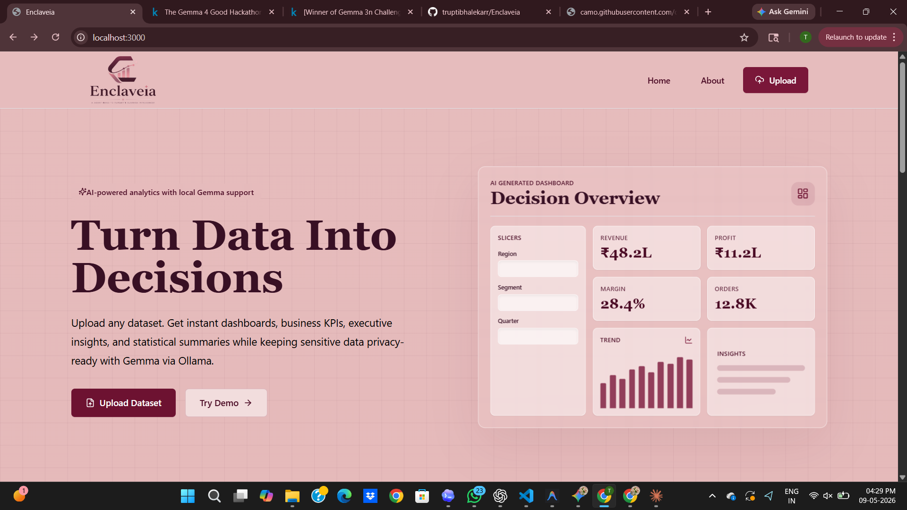
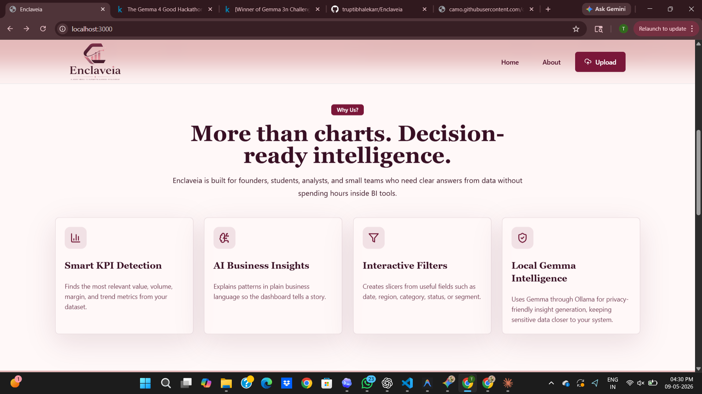
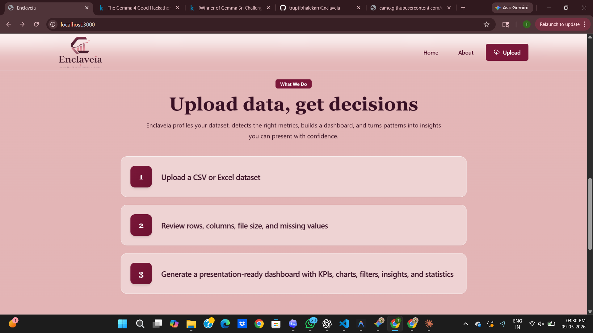
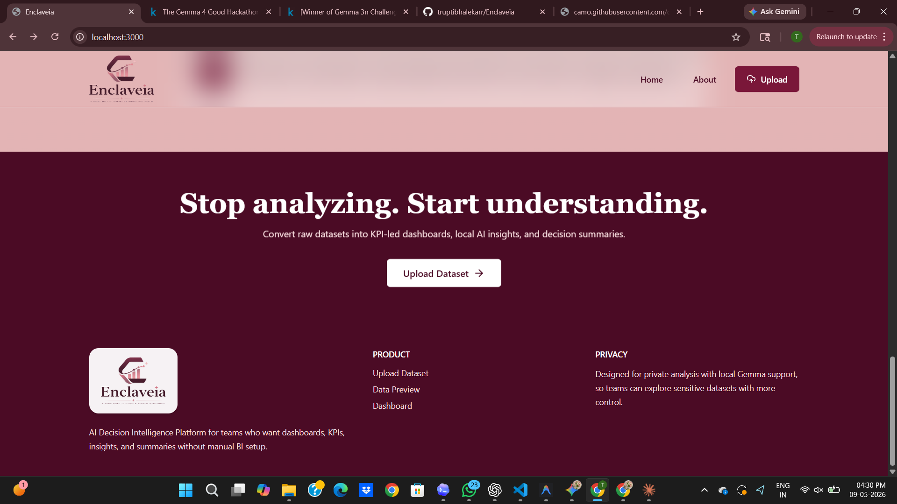
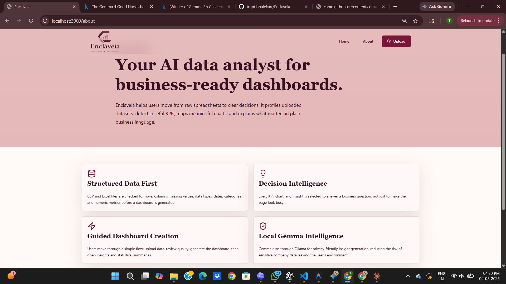
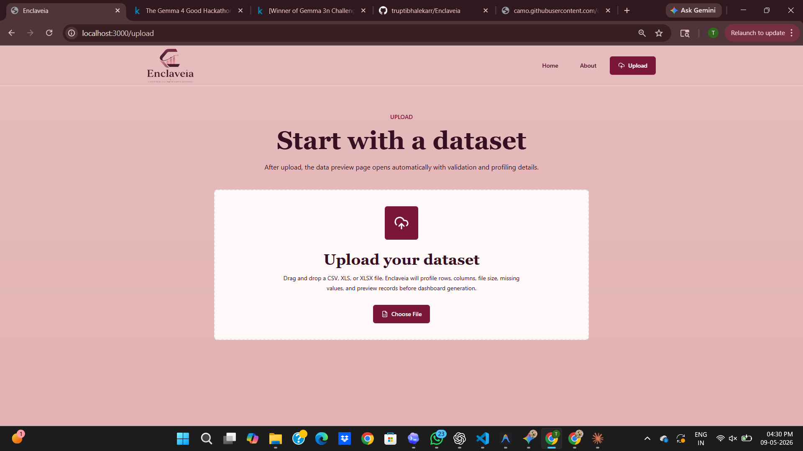
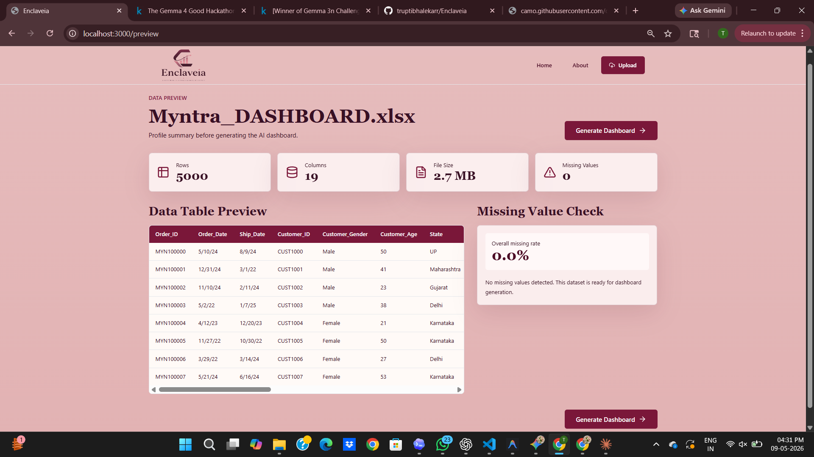
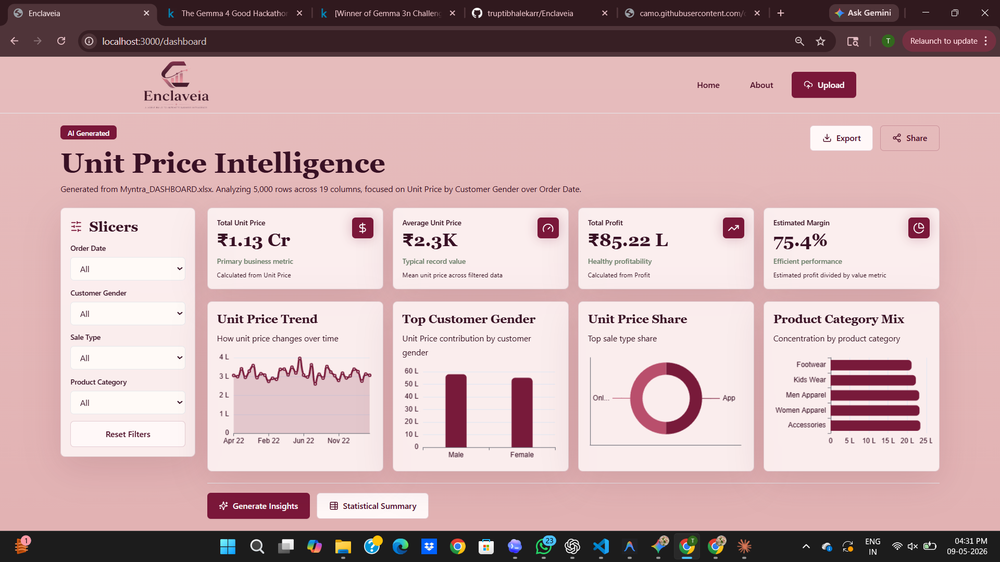
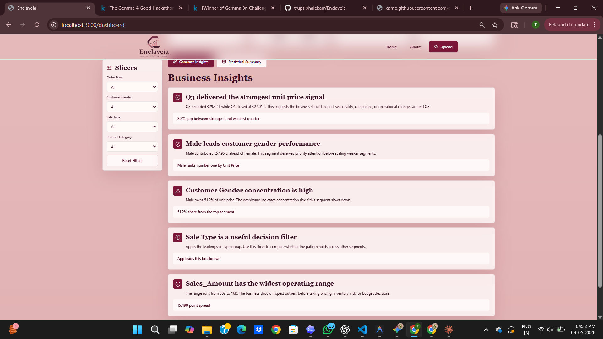
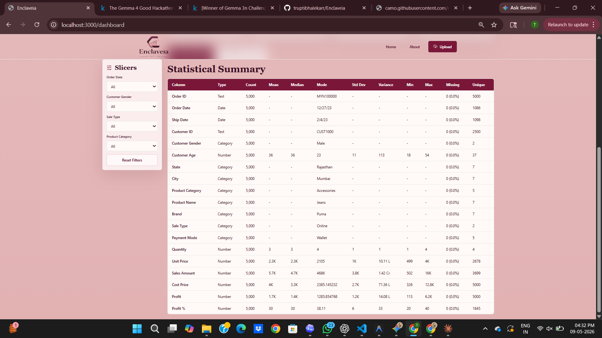

<div align="center">

  <!-- Animated Header Banner -->
  

  <!-- Logo -->
  

  <br/>
  <br/>

  <a href="https://ollama.ai/"></a>
  <a href="https://nextjs.org/"></a>
  <a href="https://fastapi.tiangolo.com/"></a>
  <a href="LICENSE"></a>
  <a href="#"></a>

  <br/>
  <br/>

  <p><strong>100% Local · Zero Data Leakage · AI-Powered Decision Intelligence</strong></p>
  <p><em>Transform raw datasets into executive dashboards and AI insights — entirely on your machine.</em></p>

</div>

---

## Table of Contents

- [The Problem](#-the-problem)
- [The Solution](#-the-solution)
- [Architecture](#️-architecture)
- [Tech Stack](#-tech-stack)
- [Feature Highlights](#-feature-highlights)
- [Product Walkthrough](#-product-walkthrough)
- [Local Setup](#-local-setup)
- [License](#-license)

---

## 🔒 The Problem

Businesses and teams today hesitate to upload sensitive financial, healthcare, or proprietary datasets to cloud-based AI tools. The reasons are clear:

- **Data privacy risks** — your data hits external servers
- **Compliance walls** — HIPAA, GDPR, and internal policies block cloud use
- **Unpredictable API costs** — token-based pricing scales poorly with large datasets

These blockers prevent teams from leveraging the true power of modern LLMs for data analytics.

---

## ✅ The Solution

**Enclaveia** is a fully local, on-premise AI decision intelligence dashboard. By running Google's **Gemma 4** model entirely on your machine via **Ollama**, Enclaveia guarantees **zero data leakage** — your data never leaves your laptop.

Upload a CSV or XLSX file and instantly get:
- KPI-led interactive dashboards
- AI-generated executive summaries and business insights
- Deep statistical profiling — all processed locally

---

## 🏛️ Architecture

Enclaveia follows a **local-first, three-layer architecture**:

```
┌─────────────────────────────────────────────────────┐
│                  Browser (localhost:3000)            │
│         Next.js · React · Tailwind · ECharts        │
│           CSV/XLSX Upload · Dashboard UI            │
└──────────────────────┬──────────────────────────────┘
                       │ HTTP
┌──────────────────────▼──────────────────────────────┐
│              Backend (localhost:8000)                │
│           FastAPI · Pandas · Prompt Engine           │
│     Data Processing · Statistical Profiling         │
└──────────────────────┬──────────────────────────────┘
                       │ Local API
┌──────────────────────▼──────────────────────────────┐
│                 AI Engine (Ollama)                   │
│                  Gemma 4 (Local)                     │
│    Insight Generation · Summaries · Interpretation  │
└─────────────────────────────────────────────────────┘
```

> **No data ever leaves your machine.** All three layers run locally.

---

## 🛠 Tech Stack

| Layer | Technology | Purpose |
|---|---|---|
| **Frontend** | Next.js 15, React, Tailwind CSS | Premium glassmorphism UI |
| **Charts** | Apache ECharts | Interactive visualizations |
| **Backend** | Python, FastAPI | Data orchestration & API |
| **Data Processing** | Pandas | Statistical profiling |
| **AI Engine** | Ollama + Gemma 4 | Local LLM inference |
| **File Support** | CSV, XLSX | Dataset ingestion |

> We chose **Next.js** over Streamlit to deliver a richer, faster, and fully customized user experience — not a generic data app.

---

## ✨ Feature Highlights

- 🔐 **Fully Local** — Gemma 4 runs via Ollama; no API keys, no cloud calls
- 📊 **Interactive Dashboards** — ECharts-powered KPI cards and drill-down charts
- 🧠 **AI Business Insights** — Tone-aware executive summaries generated from your data
- 🩺 **Data Health Check** — Automatic missing value detection, outlier flags, and type inference
- 📈 **Statistical Profiling** — Mean, median, std deviation, correlation heatmaps, and more
- 📤 **Export & Share** — Download reports or share summaries with your team
- ⚡ **Zero Setup AI** — No OpenAI key, no billing — just Ollama running locally

---

## 📸 Product Walkthrough

### 1. Landing & Upload Experience

<br/>


### 2. Data Preview & Health Check


### 3. Executive Dashboard

<br/>


### 4. AI-Generated Insights


### 5. Statistical Summary


### 6. Export & Share

<br/>

<br/>


---

## 🚀 Local Setup

No cloud API keys required. Everything runs on your machine.

### Prerequisites

| Requirement | Version | Link |
|---|---|---|
| Node.js | v18+ | [nodejs.org](https://nodejs.org/) |
| Python | 3.10+ | [python.org](https://www.python.org/) |
| Ollama | Latest | [ollama.ai](https://ollama.ai/) |

---

### Step 1 — Start Ollama & Pull Gemma 4

```bash
ollama run gemma:4
```

> Wait for the model to download. Keep this terminal open.

---

### Step 2 — Start the Backend

```bash
# From the project root
python -m venv venv

# Activate (Windows)
venv\Scripts\activate

# Activate (Mac/Linux)
source venv/bin/activate

# Install dependencies
pip install -r requirements.txt

# Start the server
cd backend
uvicorn main:app --reload --port 8000
```

---

### Step 3 — Start the Frontend

```bash
cd frontend
npm install
npm run dev
```

---

**Done!** Open [http://localhost:3000](http://localhost:3000) in your browser.

```
Ollama (Gemma 4)  →  FastAPI :8000  →  Next.js :3000
```

---

## 📜 License

This project is licensed under the [MIT License](LICENSE) — open-sourced for the **Gemma 4 Good Hackathon**.

---

<div align="center">
  
  <br/>
  <sub>Built with ❤️ by <a href="https://github.com/truptibhalekarr">truptibhalekarr</a></sub>
</div>
